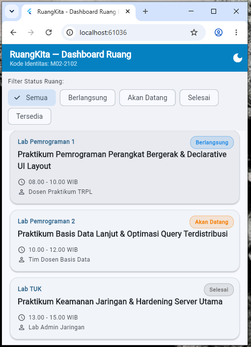
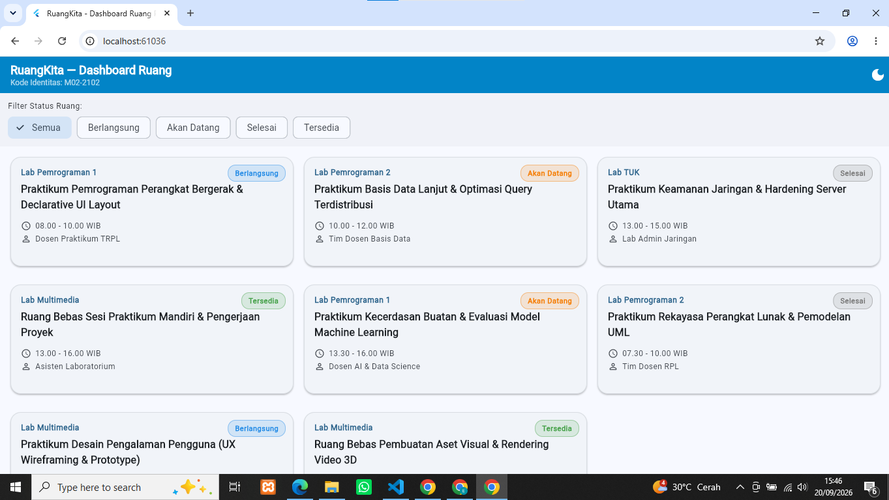
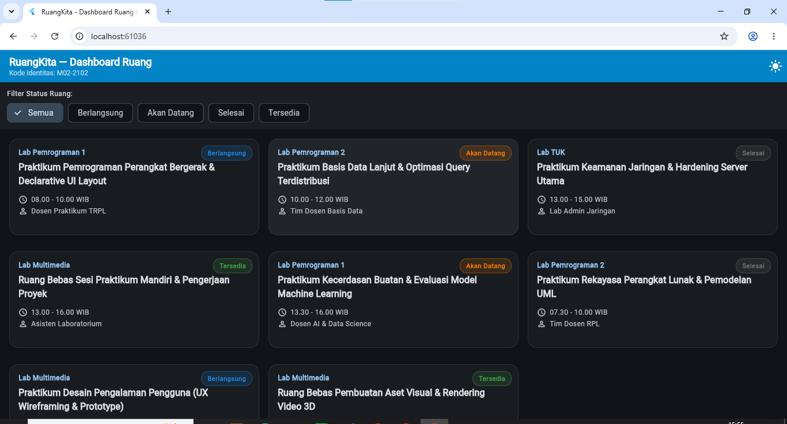
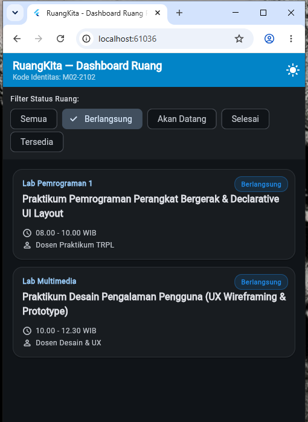

# Starter Template & Laporan Praktikum Pemrograman Mobile
### Program Studi Sarjana Terapan Teknologi Rekayasa Perangkat Lunak (TRPL)
**Politeknik Negeri Banyuwangi — Semester Ganjil 2026**

Panduan interaktif lengkap: [Portal Codelabs TRPL Poliwangi](https://codelabs-poliwangi.github.io/MobileDev-Codelabs/)

---
# Laporan Tugas Rumah Modul 02: Declarative UI & Responsive Layout

* **Nama**: Fachreza Huditama
* **NIM**: 362558302102
* **Kelas / Prodi**: 2C / Sarjana Terapan Teknologi Rekayasa Perangkat Lunak
* **Digit Terakhir NIM**: 2
* **Dosen Pengampu**: Sepyan Purnama Kristanto, M.Kom.
* **Domain Aplikasi**: Ruang Praktikum
* **Nama Aplikasi**: RuangKita - Dashboard Ketersediaan Ruang Praktikum
* **Kode Identitas UI Wajib**: M02-2102
* **Mata Kuliah**: Pemrograman Perangkat Bergerak

---

1. Arsitektur Widget

RuangKita - Dashboard Ketersediaan Ruang Praktikum merupakan aplikasi Flutter yang digunakan untuk menampilkan informasi ruang praktikum, jadwal kegiatan, status ruang, dosen atau penanggung jawab, serta kapasitas ruang.

Aplikasi menggunakan konsep Declarative UI dengan Material Design 3. Data ruang disimpan secara lokal menggunakan model RoomSession, sedangkan tampilan kartu ruang dibuat menggunakan widget terpisah RoomCard.

Responsivitas tampilan menggunakan LayoutBuilder dengan tiga kondisi layar, yaitu layar mobile dengan satu kolom, tablet dengan dua kolom, dan layar lebar dengan tiga kolom.

2. Layout Responsif
Lebar	Layout
< 600 dp	ListView.builder — 1 kolom
600–839 dp	GridView.builder — 2 kolom
≥ 840 dp	GridView.builder — 3 kolom

Layout ditentukan menggunakan LayoutBuilder.

3. Komponen Utama
Wrap + ChoiceChip untuk filter status.
LayoutBuilder untuk responsive layout.
Stack + Positioned untuk badge status.
showModalBottomSheet untuk detail ruang.
Material 3 dengan Light/Dark Mode.

## 4. Bukti Tangkapan Layar Running App

Seluruh screenshot aplikasi harus menampilkan kode identitas **M02-2102** pada header aplikasi.

### 4.1 Mobile Light Mode

**Ukuran:** `< 600dp`
**Layout:** 1 kolom

Tampilan mobile menggunakan satu kolom agar informasi kartu tetap mudah dibaca pada layar yang memiliki ruang terbatas.

### 4.2 Tablet Layout

**Ukuran:** `600 - 839dp`
**Layout:** 2 kolom

Tampilan tablet menggunakan dua kolom sehingga ruang layar yang lebih lebar dapat dimanfaatkan.

### 4.3 Dark Mode

Screenshot ini menunjukkan perubahan tampilan aplikasi setelah tombol mode tema pada AppBar ditekan.

### 4.4 mobile

---

## 5. Tautan Commit Final Repository - 
**Tautan Commit Final GitHub**: [https://github.com/rezahuditama-web pemrograman-perangkat-bergerak.git]

## 6. Jawaban Pertanyaan Refleksi Teknis

### (1) Mengapa `Expanded` Membantu Widget `Text` di Dalam `Row`?

`Row` memiliki ruang horizontal yang terbatas, sehingga teks yang terlalu panjang dapat menyebabkan `RenderFlex overflow`. Dengan menggunakan `Expanded`, widget `Text` akan menyesuaikan diri dengan sisa ruang yang tersedia. Jika dikombinasikan dengan `maxLines` dan `TextOverflow.ellipsis`, teks yang terlalu panjang dapat dipotong tanpa menyebabkan overflow.

### (2) Mengapa `LayoutBuilder` Cocok untuk Layout Lokal?

`MediaQuery` digunakan untuk mengetahui ukuran layar secara keseluruhan, sedangkan `LayoutBuilder` membaca batas ukuran dari parent widget secara langsung melalui `BoxConstraints`. Karena itu, `LayoutBuilder` lebih cocok untuk membuat komponen responsif yang dapat menyesuaikan diri dengan ruang yang tersedia, termasuk ketika digunakan pada panel atau layout yang berbeda.

### (3) Apa yang Terjadi Ketika `setState()` Dipanggil?

Ketika `setState()` dipanggil, Flutter menandai `State` sebagai perlu diperbarui dan menjalankan kembali metode `build()`. Flutter kemudian membandingkan widget yang baru dengan widget sebelumnya dan memperbarui bagian yang mengalami perubahan. Dengan cara ini, perubahan state dapat ditampilkan tanpa harus membangun ulang seluruh aplikasi.
